# Netflix Clone Deployment
Netflix clone using various tools and technologies. Jenkins will serve as the Continuous Integration and Continuous Deployment (CICD) tool, and the application will be deployed within a Docker container, managed within a Kubernetes Cluster. Additionally, for monitor Jenkins and Kubernetes metrics using Grafana, Prometheus, and Node exporter.

## Prerequisites
- An Ubuntu (22.04) T2 Large instance on a cloud provider.
- Access to a GitHub repository hosting the Netflix clone code
[repo](https://github.com/sirishacyd/devOpsmonitoring-netflixclone)


## Steps Overview
1. **Launch an Ubuntu (22.04) T2 Large Instance**
2. **Install Jenkins, Docker, and Trivy**
3. **Create a TMDB API Key**
4. **Install Prometheus and Grafana**
5. **Integrate Prometheus with Jenkins**
6. **Email Integration With Jenkins**
7. **Install Required Jenkins Plugins**
8. **Create a Jenkins Pipeline**
9. **Install OWASP Dependency Check Plugins**
10. **Docker Image Build and Push**
11. **Deploy the Image Using Docker**
12. **Kubernetes Master and Slave Setup**
13. **Access the Netflix Clone App**
14. **Terminate the AWS EC2 Instances**

## Detailed Steps

### Step 1: Launch an Ubuntu (22.04) T2 Large Instance
- Launch an AWS T2 Large Instance using the Ubuntu image.
- Configure HTTP and HTTPS settings in the security group.

### Step 2: Install Jenkins, Docker, and Trivy
- Install Jenkins: Follow the installation guide for Jenkins on Ubuntu.
- Install Docker: Use `sudo apt-get install docker.io -y`.
- Install Trivy for vulnerability scanning: Follow the Trivy installation instructions.

### Step 3: Create a TMDB API Key
- Register on the TMDB website and generate an API key.

### Step 4: Install Prometheus and Grafana
- Install Prometheus for monitoring.
- Install Grafana for analytics and monitoring visualization.

### Step 5: Integrate Prometheus with Jenkins
- Install the Prometheus plugin in Jenkins.
- Configure Prometheus to collect metrics from Jenkins.

### Step 6: Email Integration With Jenkins
- Configure Jenkins to send emails for build notifications.

### Step 7: Install Required Jenkins Plugins
- Install plugins such as JDK, SonarQube Scanner, Node.js, and OWASP Dependency Check.

### Step 8: Create a Jenkins Pipeline
- Set up a pipeline in Jenkins for CI/CD processes.

### Step 9: Install OWASP Dependency Check Plugins
- Integrate OWASP Dependency Check for security scanning.

### Step 10: Docker Image Build and Push
- Build and push the Docker image of the Netflix clone to DockerHub.

### Step 11: Deploy the Image Using Docker
- Deploy the Docker image on your server.

### Step 12: Kubernetes Master and Slave Setup
- Set up Kubernetes for orchestrating the deployment.

### Step 13 : Access Netflix Clone App and Terminate AWS EC2 Instances

1. **Access the Deployed Application:** 
   - Use a web browser to access the Netflix Clone application.

2. **Shut Down AWS EC2 Instances:** 
   - Conserve resources by shutting down the AWS EC2 instances once you're finished.


## let's get started and dig deeper into each of these steps:

## Step 1: Launch an Ubuntu(22.04) T2 Large Instance

Launch an AWS T2 Large Instance, using the Ubuntu image. You have the option to either create a new key pair or use an existing one. For the purpose of learning, enable HTTP and HTTPS settings in the security group and open all ports

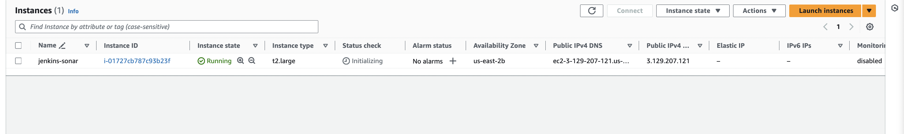

## Step 2: Install Jenkins, Docker, and Trivy

### 2A: To Install Jenkins

Connect to your console, and enter these commands to Install Jenkins

```
vi jenkins.sh #make sure run in Root (or) add at userdata while ec2 launch
```

```
#!/bin/bash
sudo apt update -y
#sudo apt upgrade -y
wget -O - https://packages.adoptium.net/artifactory/api/gpg/key/public | tee /etc/apt/keyrings/adoptium.asc
echo "deb [signed-by=/etc/apt/keyrings/adoptium.asc] https://packages.adoptium.net/artifactory/deb $(awk -F= '/^VERSION_CODENAME/{print$2}' /etc/os-release) main" | tee /etc/apt/sources.list.d/adoptium.list
sudo apt update -y
sudo apt install temurin-17-jdk -y
/usr/bin/java --version
curl -fsSL https://pkg.jenkins.io/debian-stable/jenkins.io-2023.key | sudo tee \
                  /usr/share/keyrings/jenkins-keyring.asc > /dev/null
echo deb [signed-by=/usr/share/keyrings/jenkins-keyring.asc] \
                  https://pkg.jenkins.io/debian-stable binary/ | sudo tee \
                              /etc/apt/sources.list.d/jenkins.list > /dev/null
sudo apt-get update -y
sudo apt-get install jenkins -y
sudo systemctl start jenkins
sudo systemctl status jenkins
```

```
sudo chmod 777 jenkins.sh
./jenkins.sh    # installl jenkins
```

### Configuring Jenkins After Installation

Once Jenkins is installed, follow these steps:

1. **Open Port 8080**: To access Jenkins, you need to open inbound traffic on port 8080 in your AWS EC2 Security Group. Ensure that the necessary security group rules are in place to allow incoming connections to Jenkins, as it operates on port 8080.

2. **Obtain Your Public IP Address**: server's Public IP address to access the Jenkins web interface. we can find this by checking your AWS EC2 instance details or by using a service like [WhatIsMyIP](https://www.whatismyip.com/).
access Jenkins using your Public IP address and port 8080.

```
<EC2 Public IP Address:8080>
sudo cat /var/lib/jenkins/secrets/initialAdminPassword
```

Unlock Jenkins: Use the provided administrative password to unlock Jenkins during installation.
Install Plugins: Jenkins will install the necessary plugins automatically.
User Creation: Create a user, save, and continue.
Jenkins Getting Started: You'll now see the Jenkins Getting Started screen.

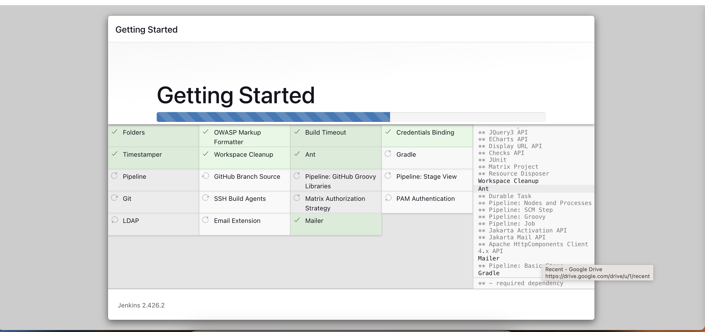

### 2A: Install Docker

```
sudo apt-get update
sudo apt-get install docker.io -y
sudo usermod -aG docker $USER   #my ubuntu
newgrp docker
sudo chmod 777 /var/run/docker.sock
```
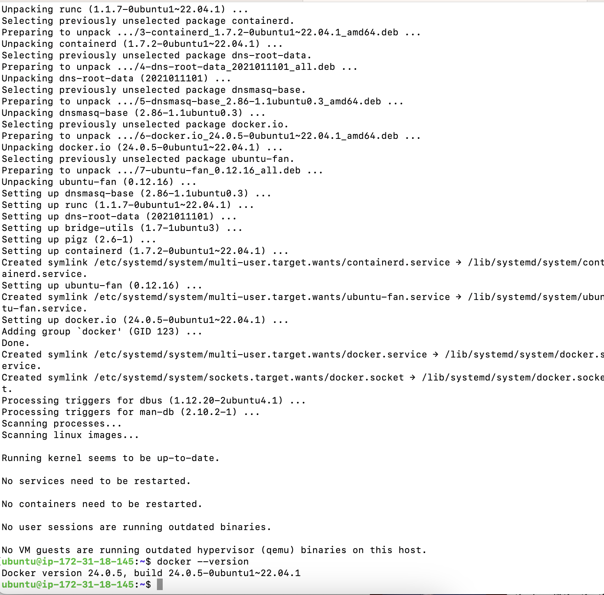
After installing Docker, proceed to create a Sonarqube container. Remember to add port 9000 to the security group rules.

```
docker run -d --name sonar -p 9000:9000 sonarqube:lts-community
```
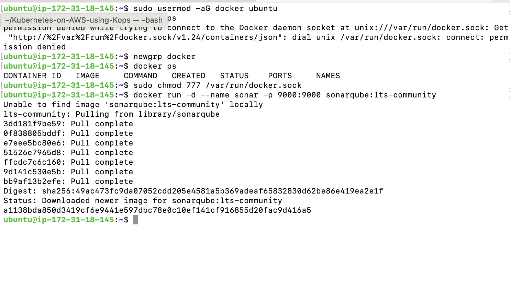

Now our sonarqube is up and running

Enter username and password, click on login and change password
```
username admin
password admin

````
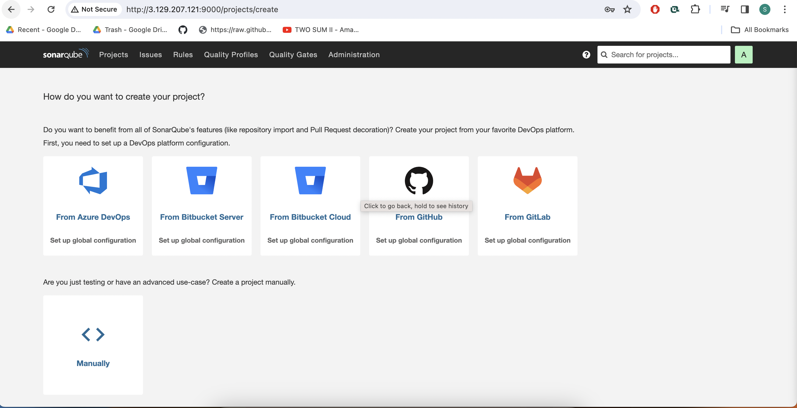

### 2A — Install Trivy

```
vi trivy.sh
```
```
sudo apt-get install wget apt-transport-https gnupg lsb-release -y
wget -qO - https://aquasecurity.github.io/trivy-repo/deb/public.key | gpg --dearmor | sudo tee /usr/share/keyrings/trivy.gpg > /dev/null
echo "deb [signed-by=/usr/share/keyrings/trivy.gpg] https://aquasecurity.github.io/trivy-repo/deb $(lsb_release -sc) main" | sudo tee -a /etc/apt/sources.list.d/trivy.list
sudo apt-get update
sudo apt-get install trivy -y
```
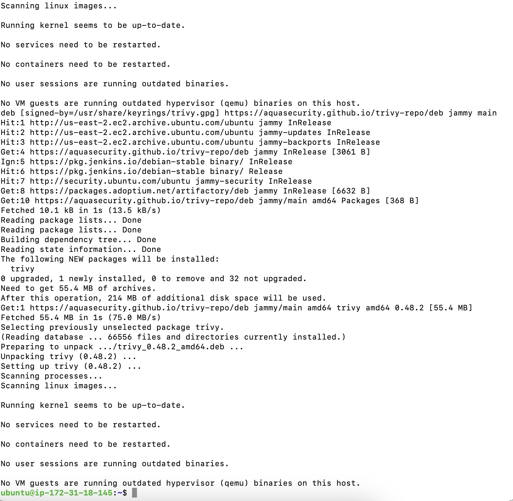


## Step 3: Create a TMDB API Key

1. Go to the TMDB website.

2. Sign in or create an account.

3. Access the API section.

4. Generate your TMDB API key.

5. Store the API key securely for future use.

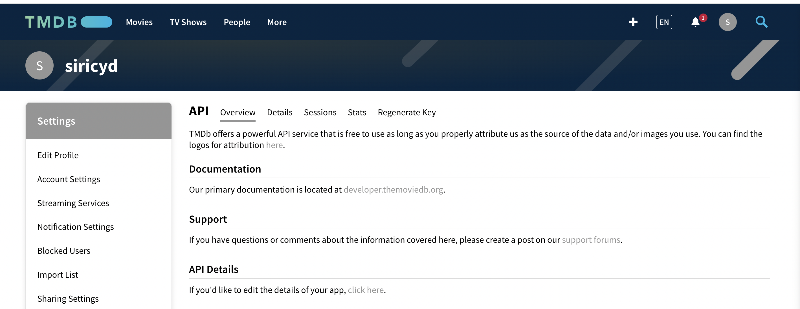

## Step 4 : Install Prometheus and Grafana On the new Server

### Create a Dedicated Linux User for Prometheus

Creating a dedicated Linux user for Prometheus is important for security and administration purposes. It helps reduce the impact of incidents and simplifies resource tracking.

To create a system user, use the following command:

```
sudo useradd \
    --system \
    --no-create-home \
    --shell /bin/false prometheus
```

### Checking and Downloading Prometheus

To get the latest Prometheus version:

1. Visit the Prometheus download page.

To download, use either `wget` or `curl`:

```
wget https://github.com/prometheus/prometheus/releases/download/v2.47.1/prometheus-2.47.1.linux-amd64.tar.gz
```

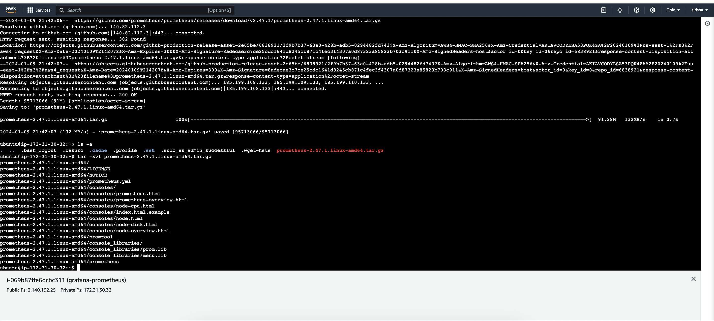

Create the necessary directories for Prometheus and its configuration files:

```bash
sudo mkdir -p /data /etc/prometheus
```

Change the current directory to the Prometheus installation directory. Replace prometheus-2.47.1.linux-amd64/ with the appropriate version if needed
```
cd prometheus-2.47.1.linux-amd64/
```
Move the Prometheus binary and promtool to the /usr/local/bin/ directory for easy execution
```
sudo mv prometheus promtool /usr/local/bin/
```
Optionally, move console libraries to the Prometheus configuration directory. These libraries are used for creating custom consoles, but you can skip this step if you're just getting started:

```
sudo mv consoles/ console_libraries/ /etc/prometheus/
```

Move the main Prometheus configuration file to its configuration directory:
```
sudo mv prometheus.yml /etc/prometheus/prometheus.yml
```
Set the correct ownership for the /etc/prometheus/ and /data/ directories to avoid permission issues
```
sudo chown -R prometheus:prometheus /etc/prometheus/ /data/
```
you can delete the Prometheus archive and folder if no longer needed:
```
cd
rm -rf prometheus-2.47.1.linux-amd64.tar.gz
```
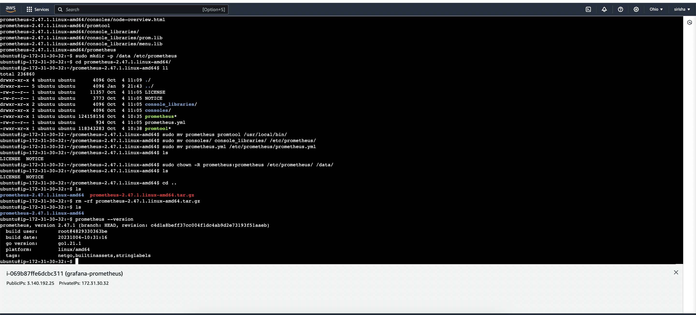
Verify that Prometheus is installed correctly and check its version:

```
prometheus --version
```

### Setting up Prometheus with Systemd

We're going to use Systemd, which is a system and service manager for Linux operating systems. For that, we need to create a Systemd unit configuration file.

1. Create the Systemd unit configuration file for Prometheus:

   ```bash
   sudo vim /etc/systemd/system/prometheus.service

Prometheus.service
```
[Unit]
Description=Prometheus
Wants=network-online.target
After=network-online.target

StartLimitIntervalSec=500
StartLimitBurst=5

[Service]
User=prometheus
Group=prometheus
Type=simple
Restart=on-failure
RestartSec=5s
ExecStart=/usr/local/bin/prometheus \
  --config.file=/etc/prometheus/prometheus.yml \
  --storage.tsdb.path=/data \
  --web.console.templates=/etc/prometheus/consoles \
  --web.console.libraries=/etc/prometheus/console_libraries \
  --web.listen-address=0.0.0.0:9090 \
  --web.enable-lifecycle

[Install]
WantedBy=multi-user.target
```

Explanation of important options in the Systemd unit configuration:

Restart: Configures whether the service shall be restarted when the service process exits, is killed, or a timeout is reached.
RestartSec: Configures the time to sleep before restarting a service.
User and Group: Linux user and group to start the Prometheus process.
--config.file=/etc/prometheus/prometheus.yml: Path to the main Prometheus configuration file.
--storage.tsdb.path=/data: Location to store Prometheus data.
--web.listen-address=0.0.0.0:9090: Configure Prometheus to listen on all network interfaces. In some situations, you may have a proxy like Nginx to redirect requests to Prometheus. In that case, you would configure Prometheus to listen only on localhost.
--web.enable-lifecycle: Allows managing Prometheus, for example, to reload configuration without restarting the service.

2.To automatically start Prometheus after a reboot, enable it:
```
sudo systemctl enable prometheus
```
3.Start Prometheus:
```
sudo systemctl start prometheus
```
4. To check the status of Prometheus, run the following command:
```
sudo systemctl status prometheus
```
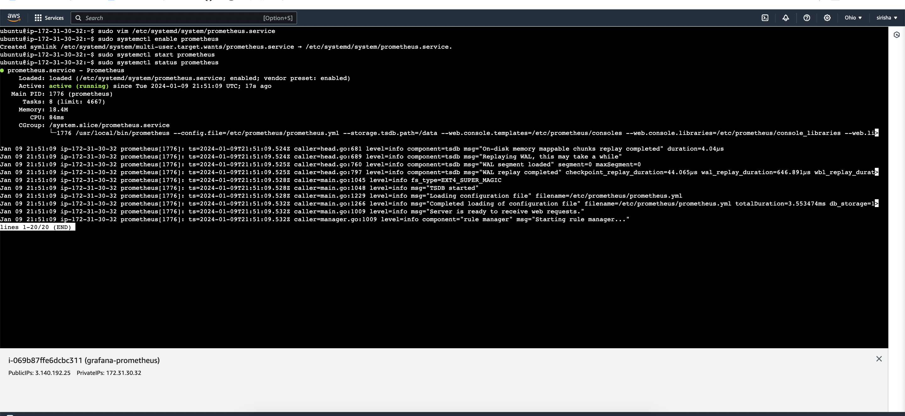

5. If you encounter any issues with Prometheus or are unable to start it, use the journalctl command to find the problem
```
journalctl -u prometheus -f --no-pager
```
6.Access Prometheus via a web browser using the IP address of your Ubuntu server and appending port 9090
```
<public-ip>:9090
```
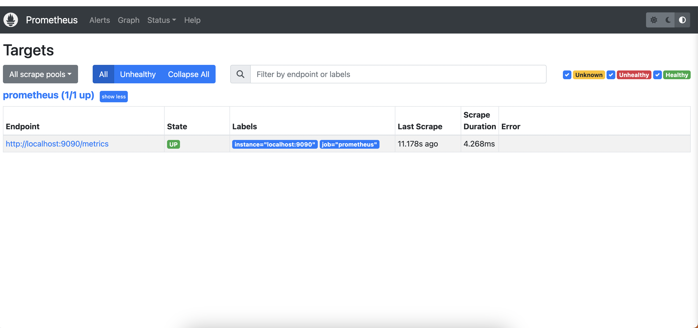

### Install Node Exporter on Ubuntu 22.04

we will set up and configure Node Exporter to collect Linux system metrics like CPU load and disk I/O. Node Exporter will expose these metrics in Prometheus-style format. The installation process for Node Exporter is similar to Prometheus.

### Create a System User for Node Exporter

To begin, create a system user for Node Exporter by running the following command:

```
sudo useradd \
    --system \
    --no-create-home \
    --shell /bin/false node_exporter
```

Use the wget command to download the binary
```
wget https://github.com/prometheus/node_exporter/releases/download/v1.6.1/node_exporter-1.6.1.linux-amd64.tar.gz
```
Extract the node exporter from the archive.
```
tar -xvf node_exporter-1.6.1.linux-amd64.tar.gz
```
Move binary to the /usr/local/bin.
```
sudo mv \
  node_exporter-1.6.1.linux-amd64/node_exporter \
  /usr/local/bin/
```
Clean up, and delete node_exporter archive and a folder.
```
rm -rf node_exporter*
```
Verify that you can run the binary
```
node_exporter --version
```

for node exporter help

```
node_exporter --help
```
Next, create a similar systemd unit file
```
sudo vim /etc/systemd/system/node_exporter.service
```
node_exporter.service
```
[Unit]
Description=Node Exporter
Wants=network-online.target
After=network-online.target

StartLimitIntervalSec=500
StartLimitBurst=5

[Service]
User=node_exporter
Group=node_exporter
Type=simple
Restart=on-failure
RestartSec=5s
ExecStart=/usr/local/bin/node_exporter \
    --collector.logind

[Install]
WantedBy=multi-user.target
```
start the Node Exporter after reboot, enable the service
```
sudo systemctl enable node_exporter
```
Then start the Node Exporter.
```
sudo systemctl start node_exporter
```
Check the status of Node Exporter with the following command
```
sudo systemctl status node_exporter
```
any issues, check logs with journalctl
```
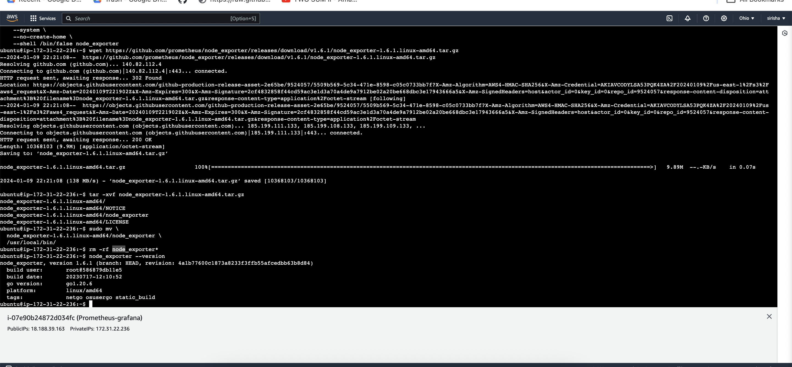
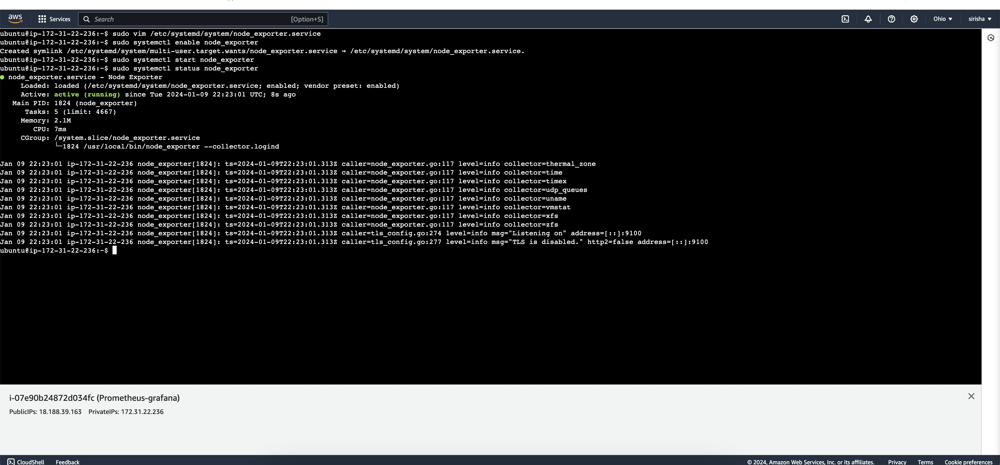

journalctl -u node_exporter -f --no-pager
```
Currently, we have only one target in Prometheus. Prometheus offers various service discovery mechanisms for dynamic target discovery in cloud environments like AWS, GCP, etc. 

To create a static target, you need to add job_name with static_configs.
```
sudo vim /etc/prometheus/prometheus.yml
```
prometheus.yml
```
  - job_name: node_export
    static_configs:
      - targets: ["localhost:9100"]
```
check if the config is valid
```
promtool check config /etc/prometheus/prometheus.yml
```
use a POST request to reload the config

```
curl -X POST http://localhost:9090/-/reload

```
Check the targets section
```
http://<ip>:9090/targets
```

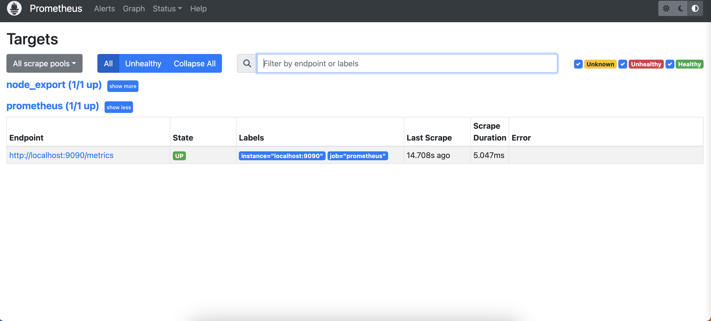

### Install Grafana on Ubuntu 22.04
Let's make sure that all the dependencies are installed.
```
sudo apt-get install -y apt-transport-https software-properties-common
```
Next, add the GPG key
```
wget -q -O - https://packages.grafana.com/gpg.key | sudo apt-key add -
```
Add this repository for stable releases
```
echo "deb https://packages.grafana.com/oss/deb stable main" | sudo tee -a /etc/apt/sources.list.d/grafana.list
```

After you add the repository, update and install Garafana
```
sudo apt-get update
sudo apt-get -y install grafana
```
reboot, enable the service.
```
sudo systemctl enable grafana-server
```
Then start the Grafana
```
sudo systemctl start grafana-server
```
To check the status of Grafana, run the following command
```
sudo systemctl status grafana-server
```
Go to http://<ip>:3000 and log in to the Grafana using default credentials. The username is admin, and the password is admin as well
```
username admin
password admin
```

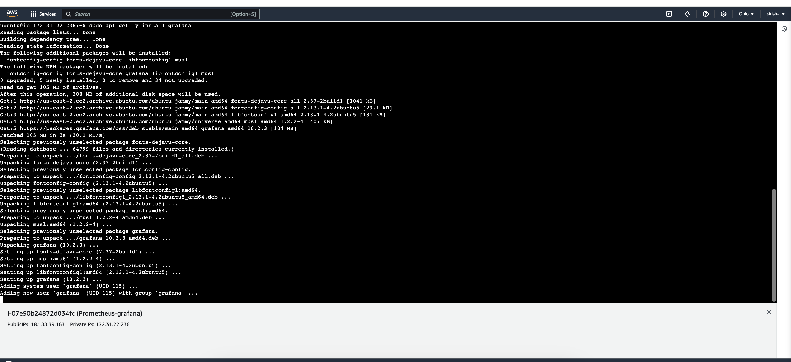

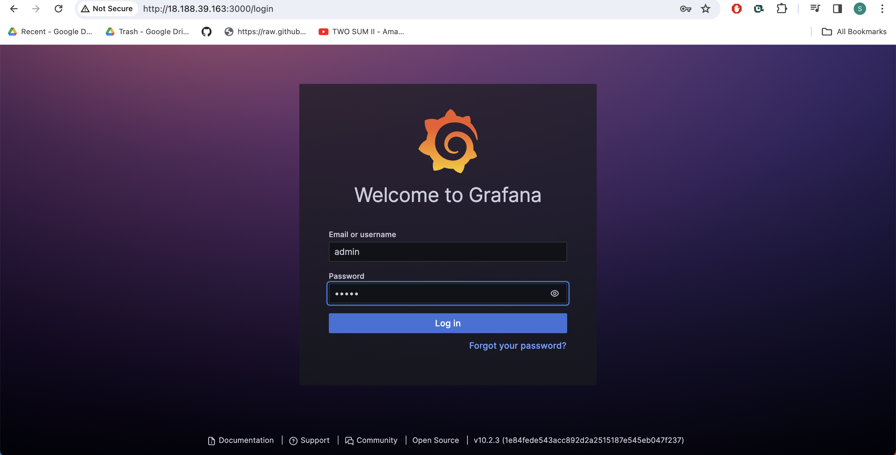

To visualize metrics, you need to add a data source first
Click Add data source and select Prometheus
For the URL, enter localhost:9090 and click Save and test. You can see Data source is working
```
<public-ip:9090>
```
Click on Save and Test

Let's add Dashboard for a better view,Click on Import Dashboard paste this code 1860 and click on load,Select the Datasource and click on Import,You will see this output

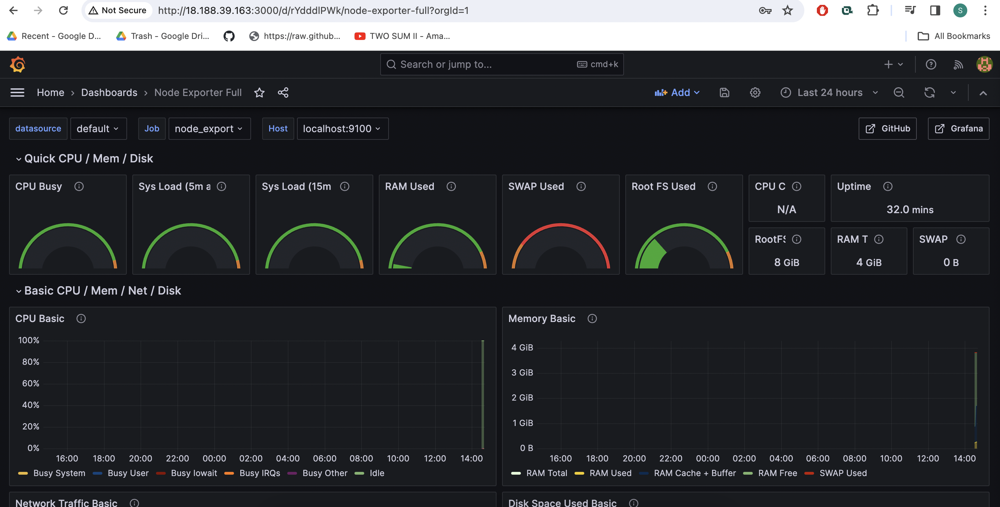

## Step 5: Install Prometheus Plugin for Jenkins

1. Ensure Jenkins is running.

2. Navigate to **Manage Jenkins** > **Manage Plugins**.

3. Search for "Prometheus" in the **Available Plugins** section.

4. Install the "Prometheus Metrics" plugin.

5. Jenkins will automatically restart after installation.

You've now installed the Prometheus Plugin. Next, we'll configure Prometheus to monitor your Jenkins system.
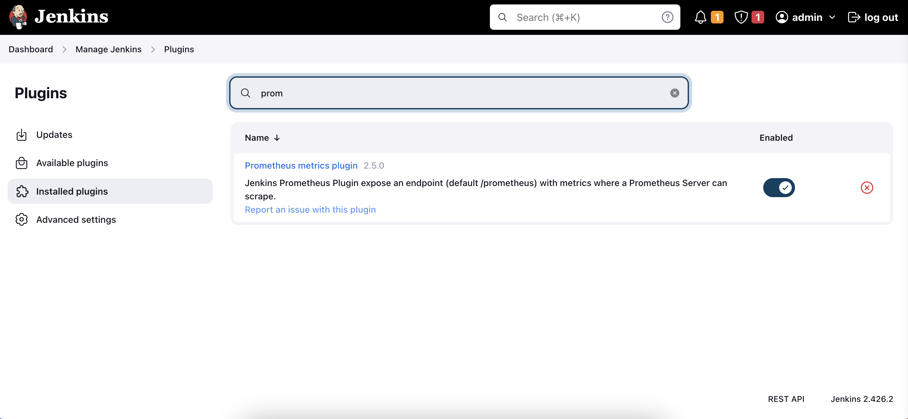

Once that is done you will Prometheus is set to /Prometheus path in system configurations

click on apply and save
add job_name with static_configs. go to Prometheus server
```
sudo vim /etc/prometheus/prometheus.yml
```

Paste below code
```
  - job_name: 'jenkins'
    metrics_path: '/prometheus'
    static_configs:
      - targets: ['<jenkins-ip>:8080']
```
Before, restarting check if the config is valid.
```
promtool check config /etc/prometheus/prometheus.yml
```

se a POST request to reload the config.

```
curl -X POST http://localhost:9090/-/reload
```

Check the targets section

```
http://<ip>:9090/targets
```

You will see Jenkins is added to it

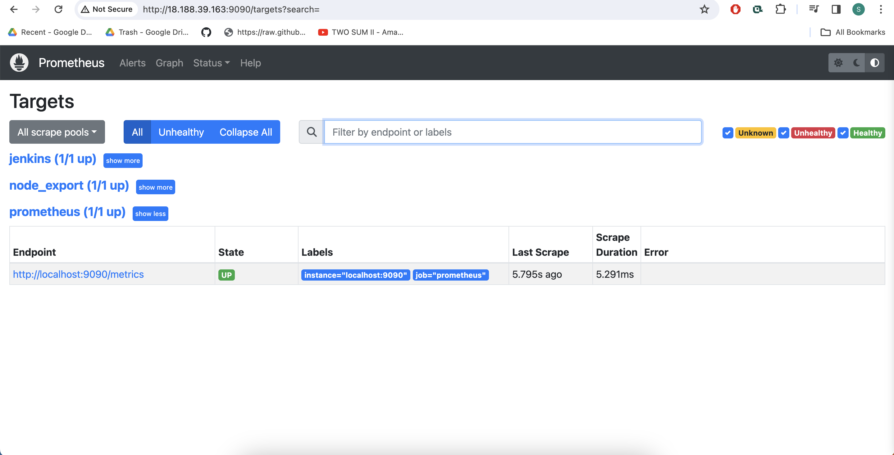

1. Access Grafana Dashboard.
2. Click on the "+" symbol in the top menu.
3. Choose "Import Dashboard."
4. Enter ID "9964" and click "Load."
5. Select the data source.
6. Click "Import" to finalize.
7. View the detailed Jenkins overview.

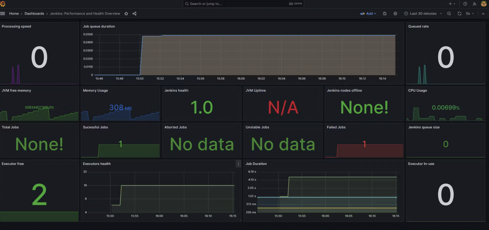

## Step 6 — Email Integration With Jenkins and Plugin Setup
Install Email Extension Plugin in Jenkins


### Configuring Gmail for Jenkins Email Notifications

1. **Enable 2-Step Verification:**
   - Go to your Gmail and click on your profile.
   - Click on "Manage Your Google Account."
   - Click on the "Security" tab on the left side panel.
   - Enable 2-step verification if not already enabled.

2. **Generate App Password:**
   - Search for "app passwords" in the search bar.
   - Click on "Other" and provide your name.
   - Click on "Generate" and copy the generated password.

3. **Install the Jenkins Plugin:**
   - Once the plugin is installed in Jenkins, go to "Manage Jenkins."
   - Click on "Configure System."
   - Under the "E-mail Notification" section, configure the details 
  
   - Click on "Apply" and save.

4. **Add Mail Username and Generated Password:**
   - Click on "Manage Jenkins" and then "Credentials."
   - Add your mail username and the generated password.

5. **Configure Extended E-mail Notification:**
   - Under the "Extended E-mail Notification" section, configure the details :

    - Click on "Apply" and save.

```
post {
     always {
        emailext attachLog: true,
            subject: "'${currentBuild.result}'",
            body: "Project: ${env.JOB_NAME}<br/>" +
                "Build Number: ${env.BUILD_NUMBER}<br/>" +
                "URL: ${env.BUILD_URL}<br/>",
            to: 'postbox.aj99@gmail.com',  #change Your mail
            attachmentsPattern: 'trivyfs.txt,trivyimage.txt'
        }
    }
```


Next, we will log in to Jenkins and start to configure our Pipeline in Jenkins

## Step 7 — Install Plugins like JDK, Sonarqube Scanner, NodeJs, OWASP Dependency Check

### 7A — Install Plugin
Goto Manage Jenkins →Plugins → Available Plugins →

Install below plugins

1 → Eclipse Temurin Installer (Install without restart)

2 → SonarQube Scanner (Install without restart)

3 → NodeJs Plugin (Install Without restart)

### 7B — Configure Java and Nodejs in Global Tool Configuration
Goto Manage Jenkins → Tools → Install JDK(17) and NodeJs(16)→ Click on Apply and Save


### 7C — Create a Job
create a job as Netflix Name, select pipeline and click on ok.

## Step 8 — Configure Sonar Server in Manage Jenkins

### Obtain Public IP and Configure Sonarqube Token

1. **Grab the Public IP Address** of your EC2 Instance.

2. **Access Sonarqube Server:**
   - Open a web browser and go to `<Public IP>:9000` (Sonarqube typically runs on Port 9000).

3. **Navigate to Administration:**
   - Click on "Administration."

4. **Generate a Token:**
   - In the Security section, click on "Users."
   - Select a user, click on "Tokens," and create a token with a name of your choice.

Save the generated token securely for authentication or other purposes.
Goto Jenkins Dashboard → Manage Jenkins → Credentials → Add Secret Text. It should look like this


Now, go to Dashboard → Manage Jenkins → System and Add like the below image.


Click on Apply and Save

The Configure System option is used in Jenkins to configure different server

Global Tool Configuration is used to configure different tools that we install using Plugins

We will install a sonar scanner in the tools.


In the Sonarqube Dashboard add a quality gate also

Administration--> Configuration-->Webhooks ->click create

Add details

```
#in url section of quality gate
<http://jenkins-public-ip:8080>/sonarqube-webhook/
```

Let's go to our Pipeline and add the script in our Pipeline Script

```
pipeline{
    agent any
    tools{
        jdk 'jdk17'
        nodejs 'node16'
    }
    environment {
        SCANNER_HOME=tool 'sonar-scanner'
    }
    stages {
        stage('clean workspace'){
            steps{
                cleanWs()
            }
        }
        stage('Checkout from Git'){
            steps{
                git branch: 'main', url: 'https://github.com/Aj7Ay/Netflix-clone.git'
            }
        }
        stage("Sonarqube Analysis "){
            steps{
                withSonarQubeEnv('sonar-server') {
                    sh ''' $SCANNER_HOME/bin/sonar-scanner -Dsonar.projectName=Netflix \
                    -Dsonar.projectKey=Netflix '''
                }
            }
        }
        stage("quality gate"){
           steps {
                script {
                    waitForQualityGate abortPipeline: false, credentialsId: 'Sonar-token' 
                }
            } 
        }
        stage('Install Dependencies') {
            steps {
                sh "npm install"
            }
        }
    }
    post {
     always {
        emailext attachLog: true,
            subject: "'${currentBuild.result}'",
            body: "Project: ${env.JOB_NAME}<br/>" +
                "Build Number: ${env.BUILD_NUMBER}<br/>" +
                "URL: ${env.BUILD_URL}<br/>",
            to: 'xxxx@gmail.com',
            attachmentsPattern: 'trivyfs.txt,trivyimage.txt'
        }
    }
}
```

Click on Build now, To see the report, you can go to Sonarqube Server and go to Projects.

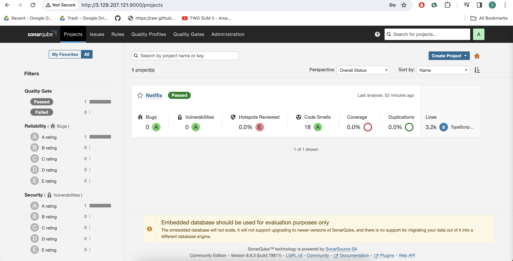

## Step 9 — Install OWASP Dependency Check Plugins
GotoDashboard → Manage Jenkins → Plugins → OWASP Dependency-Check. Click on it and install it without restart.

First, we configured the Plugin and next, we had to configure the Tool

Goto Dashboard → Manage Jenkins → Tools →


Click on Apply and Save here.

Now go configure → Pipeline and add this stage to your pipeline and build.

```
stage('OWASP FS SCAN') {
            steps {
                dependencyCheck additionalArguments: '--scan ./ --disableYarnAudit --disableNodeAudit', odcInstallation: 'DP-Check'
                dependencyCheckPublisher pattern: '**/dependency-check-report.xml'
            }
        }
        stage('TRIVY FS SCAN') {
            steps {
                sh "trivy fs . > trivyfs.txt"
            }
        }
```

The stage view would look like this,

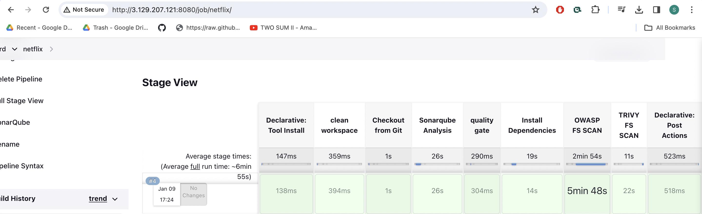

You will see that in status, a graph will also be generated and Vulnerabilities.


## Step 10 - Docker Image Build and Push

To build and push a Docker image, you first need to install the Docker tool on your system. Follow these steps:

1. **Install Docker Plugins**: Go to your system's Dashboard.
2. Navigate to **Manage Plugins**.
3. In the **Available plugins** section, use the search function to find the following plugins:
    - `Docker`
    - `Docker Commons`
    - `Docker Pipeline`
    - `Docker API`
    - `docker-build-step`
4. Once you have located these plugins, click on **Install without restart** for each plugin.
5. Now, goto Dashboard → Manage Jenkins → Tools → add docker name - choose version as latest
6. Add DockerHub Username and Password under Global Credentials
7. Add this stage to Pipeline Script

```
stage("Docker Build & Push"){
            steps{
                script{
                   withDockerRegistry(credentialsId: 'docker', toolName: 'docker'){   
                       sh "docker build --build-arg TMDB_V3_API_KEY=addkey -t netflix ."
                       sh "docker tag netflix siri/netflix:latest "
                       sh "docker push siri/netflix:latest "
                    }
                }
            }
        }
        stage("TRIVY"){
            steps{
                sh "trivy image siri/netflix:latest > trivyimage.txt" 
            }
        }

```

You will see the output below, with a dependency trend.


When you log in to Dockerhub, you will see a new image is created


Now Run the container to see if the game coming up or not by adding the below stage
```
stage('Deploy to container'){
            steps{
                sh 'docker run -d --name netflix -p 8081:80 siri/netflix:latest'
            }
        }
```

<Jenkins-public-ip:8081>

You will get this output


## Step 11 — Kuberenetes Setup
Connect your machines to Putty or Mobaxtreme

Take-Two Ubuntu 20.04 instances one for k8s master and the other one for worker.

Install Kubectl on Jenkins machine also.
Kubectl is to be installed on Jenkins also

```
sudo apt update
sudo apt install curl
curl -LO https://dl.k8s.io/release/$(curl -L -s https://dl.k8s.io/release/stable.txt)/bin/linux/amd64/kubectl
sudo install -o root -g root -m 0755 kubectl /usr/local/bin/kubectl
kubectl version --client
```
### Part 1 ----------Master Node------------
```
sudo hostnamectl set-hostname K8s-Master
```
----------Worker Node------------
```
sudo hostnamectl set-hostname K8s-Worker
```

### Part 2 ------------Both Master & Node ------------

```
sudo apt-get update 

sudo apt-get install -y docker.io
sudo usermod –aG docker Ubuntu
newgrp docker
sudo chmod 777 /var/run/docker.sock

sudo curl -s https://packages.cloud.google.com/apt/doc/apt-key.gpg | sudo apt-key add -

sudo tee /etc/apt/sources.list.d/kubernetes.list <<EOF
deb https://apt.kubernetes.io/ kubernetes-xenial main
EOF

sudo apt-get update

sudo apt-get install -y kubelet kubeadm kubectl

sudo snap install kube-apiserver
```

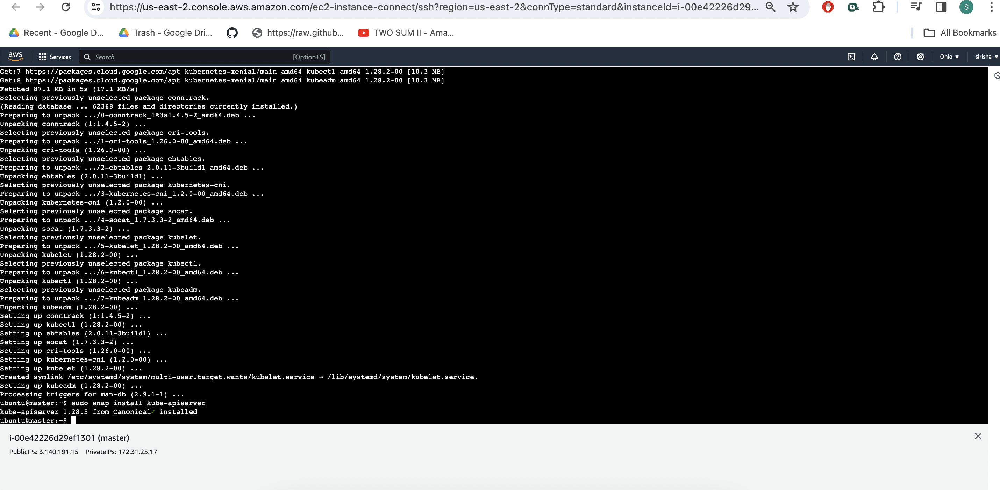
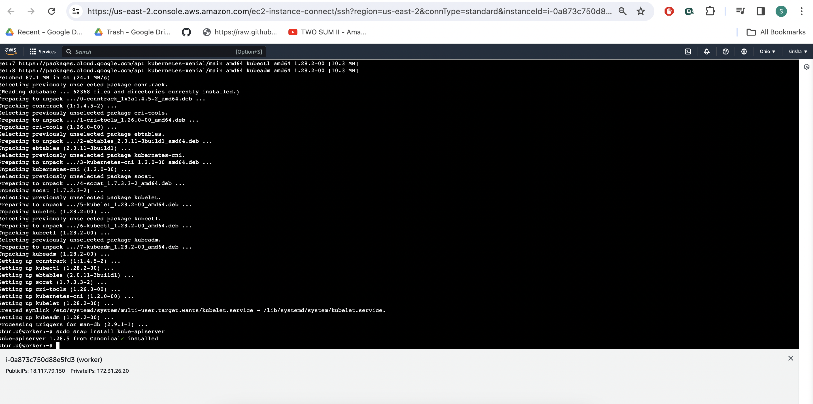

### Part 3 --------------- Master ---------------
```
sudo kubeadm init --pod-network-cidr=10.244.0.0/16
- exit from the root user and then run the below commands.
mkdir -p $HOME/.kube
sudo cp -i /etc/kubernetes/admin.conf $HOME/.kube/config
sudo chown $(id -u):$(id -g) $HOME/.kube/config
kubectl apply -f https://raw.githubusercontent.com/coreos/flannel/master/Documentation/kube-flannel.yml
```

### ----------Worker Node------------
### Worker Node Setup

Join the worker node to the Kubernetes cluster using the command:

```
sudo kubeadm join <master-node-ip>:<master-node-port> --token <token> --discovery-token-ca-cert-hash <hash>
```
Config File Handling for Jenkins:
Copy the Kubernetes config file to the Jenkins master or your local file manager.
Save it as secret-file.txt in a chosen folder (e.g., Documents).
Note: Create secret-file.txt in your file explorer, save the config in it, and use this file in the Kubernetes credential section of Jenkins.
Kubernetes Plugin Installation:
Install the Kubernetes Plugin in Jenkins.
After installation, go to Manage Jenkins -> Manage Credentials.
Click on Jenkins Global, then Add Credentials.
Select Add Secret File and save.
Install Node_exporter on Master and Worker Nodes
Creating a System User for Node Exporter:

```
sudo useradd \
    --system \
    --no-create-home \
    --shell /bin/false node_exporter
```

1.Downloading and Setting Up Node Exporter:

```
wget https://github.com/prometheus/node_exporter/releases/download/v1.6.1/node_exporter-1.6.1.linux-amd64.tar.gz
```

2.Extract the node exporter from the archive.
```
tar -xvf node_exporter-1.6.1.linux-amd64.tar.gz
```
3. Move the binary to /usr/local/bin:
```
sudo mv \
  node_exporter-1.6.1.linux-amd64/node_exporter \
  /usr/local/bin/
```

4. Clean up by deleting the Node Exporter archive and folder:
```
rm -rf node_exporter*
```
5. Verify the Node Exporter installation:
```
node_exporter --version
```

Node Exporter has a lot of plugins that we can enable. If you run Node Exporter help you will get all the options
```
node_exporter --help

```
Configuring Node Exporter:

```
sudo vim /etc/systemd/system/node_exporter.service
```

'node_exporter.service'

```
[Unit]
Description=Node Exporter
Wants=network-online.target
After=network-online.target

StartLimitIntervalSec=500
StartLimitBurst=5

[Service]
User=node_exporter
Group=node_exporter
Type=simple
Restart=on-failure
RestartSec=5s
ExecStart=/usr/local/bin/node_exporter \
    --collector.logind

[Install]
WantedBy=multi-user.target
```

- Enable and start the Node Exporter service: 
```
sudo systemctl enable node_exporter
sudo systemctl start node_exporter
```
- Check the Node Exporter status:

```
sudo systemctl status node_exporter
```
- For troubleshooting, use the following command

```
journalctl -u node_exporter -f --no-pager
```

### Configuring Prometheus Server

```
sudo vim /etc/prometheus/prometheus.yml
- Add the following job configurations in prometheus.yml:

```
prometheus.yml
```
  - job_name: node_export_masterk8s
    static_configs:
      - targets: ["<master-ip>:9100"]

  - job_name: node_export_workerk8s
    static_configs:
      - targets: ["<worker-ip>:9100"]
```
- Validate the Prometheus configuration:

```
promtool check config /etc/prometheus/prometheus.yml
```
- Reload the Prometheus configuration using a POST request.
 ```
curl -X POST http://localhost:9090/-/reload
```
- Check the Prometheus targets:
```
http://<ip>:9090/targets
```


- Final step to deploy on the Kubernetes cluster

```
stage('Deploy to kubernets'){
            steps{
                script{
                    dir('Kubernetes') {
                        withKubeConfig(caCertificate: '', clusterName: '', contextName: '', credentialsId: 'k8s', namespace: '', restrictKubeConfigAccess: false, serverUrl: '') {
                                sh 'kubectl apply -f deployment.yml'
                                sh 'kubectl apply -f service.yml'
                        }   
                    }
                }
            }
        }
```
- stage view


- In the Kubernetes cluster(master) give this command

```
kubectl get all 
kubectl get svc #use anyone
```
## STEP 12:Access from a Web browser with
```
<public-ip-of-slave:service port>
```


### Monitoring


### Mail 
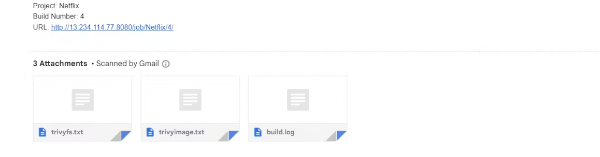

### Step 13: Terminate instances.

Complete Pipeline
```
pipeline{
    agent any
    tools{
        jdk 'jdk17'
        nodejs 'node16'
    }
    environment {
        SCANNER_HOME=tool 'sonar-scanner'
    }
    stages {
        stage('clean workspace'){
            steps{
                cleanWs()
            }
        }
        stage('Checkout from Git'){
            steps{
                git branch: 'main', url: 'https://github.com/sirishacyd/netflix-clone'
            }
        }
        stage("Sonarqube Analysis "){
            steps{
                withSonarQubeEnv('sonar-server') {
                    sh ''' $SCANNER_HOME/bin/sonar-scanner -Dsonar.projectName=Netflix \
                    -Dsonar.projectKey=Netflix '''
                }
            }
        }
        stage("quality gate"){
           steps {
                script {
                    waitForQualityGate abortPipeline: false, credentialsId: 'Sonar-token' 
                }
            } 
        }
        stage('Install Dependencies') {
            steps {
                sh "npm install"
            }
        }
        stage('OWASP FS SCAN') {
            steps {
                dependencyCheck additionalArguments: '--scan ./ --disableYarnAudit --disableNodeAudit', odcInstallation: 'DP-Check'
                dependencyCheckPublisher pattern: '**/dependency-check-report.xml'
            }
        }
        stage('TRIVY FS SCAN') {
            steps {
                sh "trivy fs . > trivyfs.txt"
            }
        }
        stage("Docker Build & Push"){
            steps{
                script{
                   withDockerRegistry(credentialsId: 'docker', toolName: 'docker'){   
                       sh "docker build --build-arg TMDB_V3_API_KEY=addkey -t netflix ."
                       sh "docker tag netflix siri/netflix:latest "
                       sh "docker push siri/netflix:latest "
                    }
                }
            }
        }
        stage("TRIVY"){
            steps{
                sh "trivy image siri/netflix:latest > trivyimage.txt" 
            }
        }
        stage('Deploy to container'){
            steps{
                sh 'docker run -d --name netflix -p 8081:80 siri/netflix:latest'
            }
        }
        stage('Deploy to kubernets'){
            steps{
                script{
                    dir('Kubernetes') {
                        withKubeConfig(caCertificate: '', clusterName: '', contextName: '', credentialsId: 'k8s', namespace: '', restrictKubeConfigAccess: false, serverUrl: '') {
                                sh 'kubectl apply -f deployment.yml'
                                sh 'kubectl apply -f service.yml'
                        }   
                    }
                }
            }
        }

    }
    post {
     always {
        emailext attachLog: true,
            subject: "'${currentBuild.result}'",
            body: "Project: ${env.JOB_NAME}<br/>" +
                "Build Number: ${env.BUILD_NUMBER}<br/>" +
                "URL: ${env.BUILD_URL}<br/>",
            to: 'xxx@gmail.com',
            attachmentsPattern: 'trivyfs.txt,trivyimage.txt'
        }
    }
}
```
